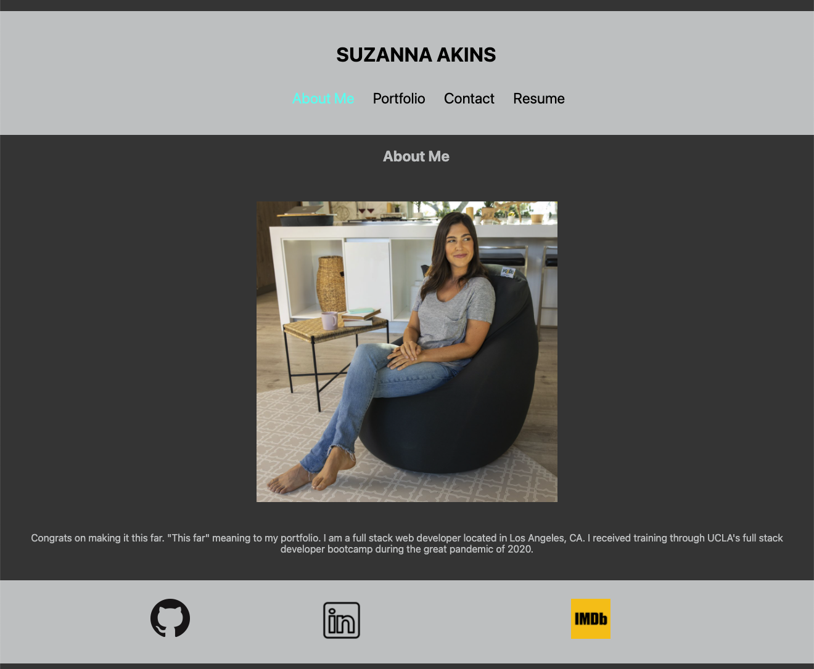

# Portfolio

## Description
This is my web developer portfolio.  I wanted to create a new portfolio using React, so I could practice, and also I love the SPA (single page application) aspect of React sites.  I used create-react-app and then developed the application from there.  I still need to add some backend for the contact form - coming soon!

## Table of Contents
* [Preview](#preview)
* [Installation](#installation)
* [Tests](#tests)
* [Questions](#questions)

## Preview

## Installation
To install necessary dependencies, run the following command:
npm i

## Tests
To run tests, run the following command: 

## Questions
If you have any questions about the repo, open an issue or contact me directly at suzannaakins@gmail.com.
You can find more of my work at github.com/suzannaakins.
